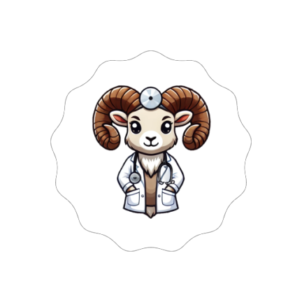

<div align="center">



<h1>CIMAHUB</h1>

<p>
<b>Simulador de casos clínicos para estudiantes de ciencias de la salud</b><br/>
Un nuevo método de aprendizaje
</p>

<p>


</p>

</div>

## ¿Qué es CIMAHUB?

**CIMAHUB** es un simulador de casos clínicos pensado para estudiantes de ciencias de la salud. En lugar de estudiar un caso solo desde el texto, el estudiante entra a una simulación donde revisa al paciente, sus signos vitales en un monitor, los estudios y maniobras asociados, y comprueba lo aprendido con un quiz al final.

El sistema tiene dos caras que comparten la misma base de datos en **Supabase**: una **app Android** (Kotlin + Jetpack Compose) y una **versión web** (HTML, CSS y JavaScript). Los docentes pueden dar de alta nuevos casos y los estudiantes los consultan desde cualquiera de las dos.

El objetivo: ofrecer una forma más práctica e interactiva de aprender, donde el estudiante pueda enfrentarse a un caso clínico, explorarlo por partes y recibir retroalimentación inmediata.

> **Estado actual:** proyecto en desarrollo. La app y la web leen los mismos casos desde Supabase; el acceso por rol (Estudiante / Docente) es por ahora una selección en pantalla, todavía sin autenticación de usuarios.

---

## Características

- **Catálogo de casos por carpetas** (por ejemplo, ECOE), con el conteo de casos de cada carpeta
- **Simulación en cinco pestañas:** Caso, Estudios, Maniobras, Electro y Quiz
- **Monitor de signos vitales (CIMED MONITOR)** con cinco canales animados: ECG, SpO2, presión arterial invasiva, EEG/BIS y capnografía, ajustados a los valores del caso
- **Ficha completa del paciente:** nombre, sexo, edad, peso, altura, motivo de consulta, antecedentes y signos vitales (FC, TA, FR, temperatura, SpO2, BIS y EtCO2)
- **Estudios y maniobras** asociados a cada caso, con sus archivos y videos de referencia
- **Quiz de opción múltiple** con explicación de la respuesta correcta
- **Atlas anatómico interactivo (Android):** zoom con gestos, tres niveles de imagen (cuerpo completo, torso y cráneo) y puntos de interés que abren el caso relacionado
- **Modo Estudiante y modo Docente:** el docente puede crear casos nuevos desde la app (datos básicos, anamnesis, exploración física y signos vitales iniciales)
- **Filtros de visión** desde el menú de Accesibilidad: Normal, Protanopia, Deuteranopia, Tritanopia, Acromatopsia y Cataratas
- **Datos en la nube** con Supabase (PostgreSQL), compartidos entre la app y la web

---

## Arquitectura

<div align="center">  </div>

<sub>Tanto la app como la web descargan cada caso completo con una sola consulta a Supabase (el caso más sus signos vitales, estudios, procedimientos y preguntas). En Android, un ViewModel expone el estado a las pantallas de Compose a través de un repositorio; en la web, un script carga el caso y rellena la simulación.</sub>

---

## Estructura del repositorio

```
CIMAHUB/
├── app/                                # App Android
│   └── src/main/
│       ├── java/com/example/cimahub/
│       │   ├── data/                   # Modelos, cliente Supabase y repositorio
│       │   ├── ui/
│       │   │   ├── screens/            # Login, Casos, Nuevo caso, Atlas, Simulación
│       │   │   ├── components/         # Detalle de caso, fondo dinámico
│       │   │   ├── navigation/         # Grafo de navegación
│       │   │   ├── theme/              # Colores, tipografía y tema
│       │   │   └── viewmodel/          # Estado, rol de usuario y filtros de visión
│       │   └── MainActivity.kt
│       ├── assets/cases.json           # Casos de ejemplo
│       └── res/drawable/               # Logo e imágenes del atlas
├── css/                                # Estilos de la versión web
├── js/simulacion.js                    # Lógica de la simulación web
├── CIMAHUB LOG.html                    # Portada de CIMAHUB FCITEC
├── CIMAHUB.html                        # Catálogo de casos por carpeta
├── CIMAHUB SIMULACIÓN.html             # Simulación de un caso
├── ILUSTRACIONES CUERPO HUMANO/        # Ilustraciones base del atlas
├── cases.json                          # Casos de ejemplo
├── gradle/                             # Wrapper de Gradle
└── build.gradle.kts
```

---

## ¿Cómo funciona una simulación?

Cada caso clínico vive en Supabase como un registro principal (`casos_clinicos`) con cuatro tipos de información relacionada. Al abrir un caso, la app o la web lo descargan completo y lo presentan en cinco pestañas:

- **Caso:** datos del paciente, motivo de consulta, antecedentes y signos vitales iniciales.
- **Estudios:** los archivos asociados al caso.
- **Maniobras:** los procedimientos del caso, cada uno con su video de referencia.
- **Electro:** un monitor de signos vitales que dibuja en tiempo real ECG, SpO2, presión arterial, EEG/BIS y capnografía. El ritmo de las ondas sale de la frecuencia cardiaca y respiratoria registradas en el caso.
- **Quiz:** preguntas de opción múltiple; al responder, se muestra la explicación de la respuesta correcta antes de pasar a la siguiente.

En la app Android, el **atlas anatómico** conecta la anatomía con los casos: cada caso puede tener un punto de interés (por ejemplo `heart`, `lungs` o `brain`). Al tocar esa zona del atlas se abre el caso relacionado, y el nivel de zoom cambia la imagen mostrada (cuerpo completo, torso o cráneo).

---

## Tech Stack

<p align="center">
  
</p>
<p align="center">
  
  
  
</p>

---

<!--
## Capturas de pantalla

Agrega tus capturas en una carpeta `capturas/` y descomenta esta sección.

<p align="center">
  
  
  
  
</p>

---
-->

## Instalación y uso

### 1. Base de datos (Supabase)
1. Crea un proyecto en [Supabase](https://supabase.com/)
2. Crea las tablas `casos_clinicos`, `signos_vitales`, `estudios`, `procedimientos` y `preguntas_quiz`. Las columnas que espera la app están definidas en `app/src/main/java/com/example/cimahub/data/models/MedicalModels.kt`
3. Configura las políticas de acceso (RLS) para permitir la lectura de casos y, si usarás el modo Docente, la escritura
4. **Importante:** usa siempre la llave pública (`anon` / `publishable`) en la app y en la web. Nunca uses la llave `service_role`

### 2. App Android
1. Abre el proyecto en **Android Studio**
2. Crea un archivo `secrets.properties` en la raíz del proyecto (ya está incluido en el `.gitignore`, **no lo subas a GitHub**):

```properties
SUPABASE_URL=https://tu-proyecto.supabase.co
SUPABASE_KEY=tu_llave_publica
```

3. Sincroniza Gradle y ejecuta la app en un emulador o dispositivo con Android 7.0 (API 24) o superior

### 3. Versión web
1. Crea el archivo `js/secrets.js` (también ignorado por Git):

```js
const SUPABASE_URL = "https://tu-proyecto.supabase.co";
const SUPABASE_KEY = "tu_llave_publica";
```

2. Sirve la carpeta con cualquier servidor estático y abre el catálogo:

```bash
python -m http.server 8000
# abre http://localhost:8000/CIMAHUB.html
```

---

<div align="center">

Hecho por [**Dominic Escobar**](https://github.com/Dominatricxx)


</div>
